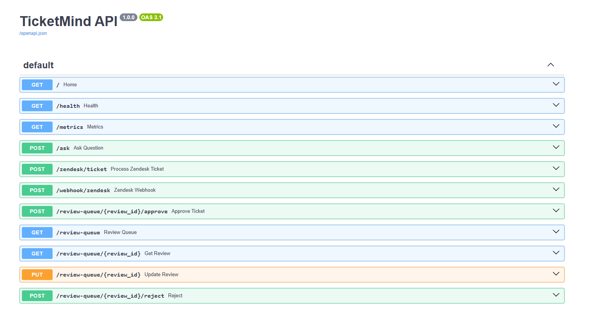
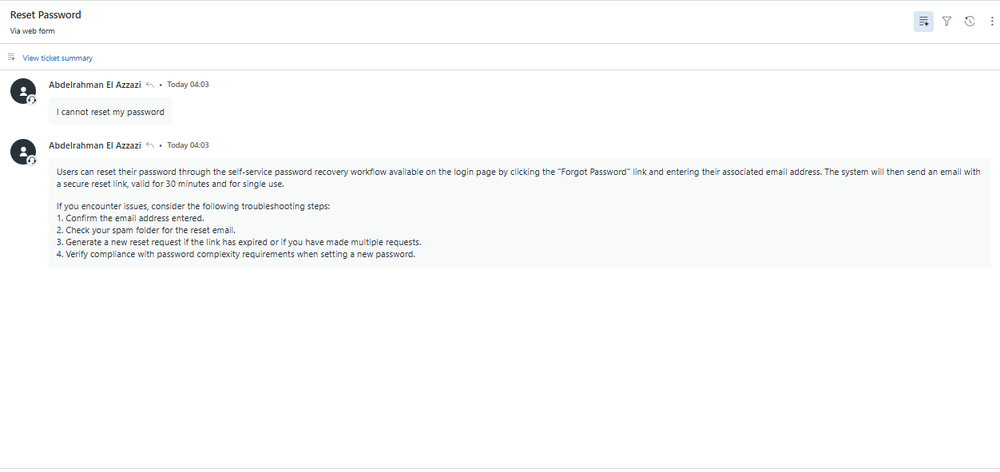
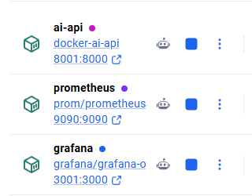

# 🚀 TicketMind

> AI-Powered Customer Support Automation using Retrieval-Augmented Generation (RAG), Google Gemini, Pinecone, Zendesk, FastAPI, Docker, Prometheus & Grafana.


---

# 📌 Overview

TicketMind is an AI-powered customer support automation platform that integrates with Zendesk to automatically resolve customer support tickets using Retrieval-Augmented Generation (RAG).

Instead of relying solely on an LLM, TicketMind retrieves relevant knowledge from Pinecone, generates grounded responses using Google Gemini, evaluates response confidence, and intelligently decides whether to:

- ✅ Automatically publish the response
- 👨‍💻 Route the ticket for Human Review

The platform also includes real-time monitoring using Prometheus and Grafana, making it suitable for production-oriented AI workflows.

---

# ✨ Features

- 🤖 AI-powered ticket resolution
- 🧠 Retrieval-Augmented Generation (RAG)
- 🔎 Semantic Search with Pinecone
- 💬 Google Gemini Integration
- 🎫 Zendesk Webhook Integration
- 👨‍💻 Human Review Queue
- 📊 Grafana Dashboard
- 📈 Prometheus Metrics
- 🐳 Dockerized Deployment
- ⚡ FastAPI REST API

---

# 🏗️ System Architecture


TicketMind follows a modular AI architecture where incoming support tickets are processed through a Retrieval-Augmented Generation pipeline before either being automatically published or routed to human review.

📖 More Details

👉 [System Architecture](docs/01-System-Architecture.md)

---

# 🧠 RAG Pipeline


Each incoming ticket is:

1. Embedded using Gemini Embeddings.
2. Retrieved from Pinecone Vector Database.
3. Passed to Google Gemini for grounded answer generation.
4. Evaluated based on confidence.
5. Automatically approved or routed to Human Review.

📖 More Details

👉 [RAG Pipeline Documentation](docs/02-RAG-Pipeline.md)

---

# 👨‍💻 Human Review Workflow

Low-confidence AI responses are automatically routed to a review queue.

Support agents can:

- Review
- Edit
- Approve
- Reject

responses before publishing them back to Zendesk.

📖 Documentation

👉 [Human Review Workflow](docs/03-Human-Review.md)

---

# 📊 Monitoring

TicketMind includes built-in observability using Prometheus and Grafana.

Tracked Metrics include:

- Total Tickets
- Auto Approved Tickets
- Human Review Tickets
- Rejected Tickets
- Average Response Time

📖 Documentation

👉 [Monitoring Documentation](docs/05-Monitoring.md)

---

# 📸 Project Screenshots

## 🧩 Swagger API



---

## 🎫 Zendesk Integration



---

## 👨‍💻 Human Review Queue


---

## 📊 Grafana Dashboard


---

## 📈 Prometheus Targets


---

## 🐳 Docker Containers



---

# 🚀 Quick Start

Clone the repository

```bash
git clone https://github.com/your-username/TicketMind.git
```

Go to the Docker folder

```bash
cd TicketMind/docker
```

Run the application

```bash
docker compose up --build
```

Open the following services:

| Service | URL |
|----------|-----|
| Swagger UI | http://localhost:8001/docs |
| Prometheus | http://localhost:9090 |
| Grafana | http://localhost:3001 |

---

# 📚 Documentation

| Document | Description |
|----------|-------------|
| 01-System-Architecture | Overall system architecture |
| 02-RAG-Pipeline | Retrieval-Augmented Generation workflow |
| 03-Human-Review | Human review and approval workflow |
| 04-Deployment | Docker deployment guide |
| 05-Monitoring | Prometheus & Grafana monitoring |
| 06-API-Reference | REST API documentation |
| 07-Future-Roadmap | Planned future improvements |

---

# 📂 Project Structure

```text
TicketMind/
│
├── Data/
│   └── Knowledge_base/
│
├── docker/
│
├── docs/
│   ├── diagrams/
│   ├── screenshots/
│   ├── 01-System-Architecture.md
│   ├── 02-RAG-Pipeline.md
│   ├── 03-Human-Review.md
│   ├── 04-Deployment.md
│   ├── 05-Monitoring.md
│   ├── 06-API-Reference.md
│   └── 07-Future-Roadmap.md
│
├── src/
│
├── tests/
│
├── api.py
├── requirements.txt
├── README.md
└── LICENSE
```

---

# 🛠️ Technology Stack

| Category | Technology |
|----------|------------|
| Backend | FastAPI |
| AI Model | Google Gemini 2.5 Flash |
| Embeddings | Gemini Embedding |
| Vector Database | Pinecone |
| Ticketing System | Zendesk |
| Monitoring | Prometheus |
| Dashboard | Grafana |
| Database | SQLite |
| Containerization | Docker |

---

# 🗺️ Future Roadmap

Future improvements include:

- JWT Authentication
- Role-Based Access Control (RBAC)
- PostgreSQL
- Redis Caching
- Kubernetes Deployment
- CI/CD with GitHub Actions
- Multi-Agent AI Architecture
- Conversation Memory
- Multi-Tenant Support

More Details

👉 [Future Roadmap](docs/07-Future-Roadmap.md)

---

# 🤝 Contributing

Contributions are welcome.

If you'd like to improve TicketMind:

1. Fork the repository.
2. Create a feature branch.
3. Commit your changes.
4. Open a Pull Request.

---

# 📄 License

This project is licensed under the MIT License.

---

# ⭐ Support

If you found this project useful, consider giving it a ⭐ on GitHub.

It really helps support the project and motivates future improvements.