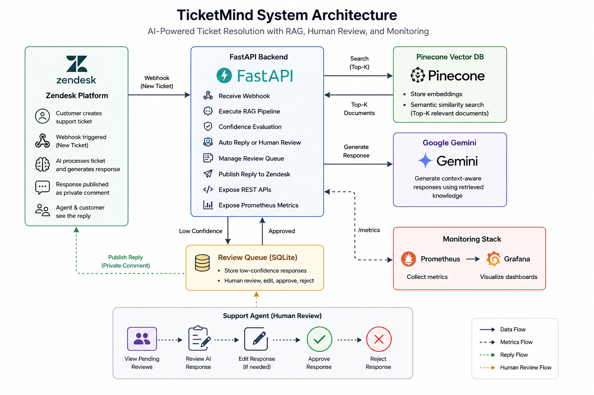

Zendesk
    │
Webhook
    │
FastAPI
    │
Retriever
    │
Pinecone
    │
Gemini
    │
Confidence Check
 ┌──────────┴───────────┐
 │                      │
Auto Reply        Human Review
 │                      │
Zendesk         Swagger Approval
                        │
                     Zendesk

# 🏗️ TicketMind System Architecture

## Overview

TicketMind is an AI powered customer support automation platform that integrates with Zendesk to streamline ticket resolution using Retrieval Augmented Generation (RAG).

Instead of relying solely on a Large Language Model (LLM), the system retrieves relevant knowledge from a vector database (Pinecone), generates context-aware responses using Google Gemini, and automatically determines whether a response is safe for automatic publishing or requires human approval.

The project is fully containerized using Docker and includes monitoring with Prometheus and Grafana.

---

# Architecture Diagram

---

# System Components

## Zendesk

Receives customer support requests and triggers a webhook whenever a new ticket is created.

**Responsibilities**

- Receive customer tickets
- Trigger AI workflow
- Display AI-generated responses
- Receive approved human-reviewed replies

---

## FastAPI Backend

Acts as the central orchestration layer.

It receives webhook requests, manages the RAG pipeline, communicates with Pinecone and Gemini, handles review workflows, and exposes monitoring endpoints.

**Responsibilities**

- Receive incoming webhooks
- Execute the AI pipeline
- Manage Review Queue
- Expose REST APIs
- Publish Prometheus metrics

---

## Pinecone Vector Database

Stores vector embeddings for the internal knowledge base.

During inference, the backend retrieves the most relevant documents before generating an answer.

**Responsibilities**

- Store embeddings
- Perform semantic similarity search
- Return Top-K relevant documents

---

## Google Gemini

Generates context-aware answers using the retrieved knowledge.

The model never answers directly without context retrieved from Pinecone.

---

## Review Queue

Low-confidence responses are stored locally for manual review.

Support agents can:

- Review
- Edit
- Approve
- Reject

responses before publishing them to Zendesk.

---

## Prometheus

Collects application metrics such as:

- Total Tickets
- Auto Approved Tickets
- Human Review Tickets
- Rejected Tickets
- Response Time

---

## Grafana

Visualizes Prometheus metrics through interactive dashboards.

The dashboard provides a quick overview of system activity and AI performance.

---

# Request Flow

1. Customer submits a support ticket in Zendesk.
2. Zendesk triggers the FastAPI webhook.
3. The backend extracts the ticket information.
4. The user query is embedded.
5. Pinecone retrieves the most relevant documents.
6. Google Gemini generates a response using the retrieved context.
7. The confidence score is evaluated.
8. If confidence is sufficient:
   - The response is automatically published to Zendesk.
9. Otherwise:
   - The ticket is added to the Human Review Queue.
10. A support agent reviews the response through Swagger.
11. Once approved, the response is published back to Zendesk.

---

# Technology Stack

| Layer | Technology |
|--------|------------|
| Backend | FastAPI |
| Programming Language | Python |
| LLM | Google Gemini 2.5 Flash |
| Embeddings | Gemini Embedding |
| Vector Database | Pinecone |
| Ticketing System | Zendesk |
| Monitoring | Prometheus |
| Dashboard | Grafana |
| Containerization | Docker & Docker Compose |
| Local Database | SQLite |

---

# Key Features

- AI-powered ticket resolution
- Retrieval-Augmented Generation (RAG)
- Human-in-the-loop workflow
- Automatic Zendesk replies
- Review Queue
- REST API
- Dockerized deployment
- Prometheus metrics
- Grafana dashboards
- Production-ready architecture

---

# Next Documentation

Continue with:

- 02-RAG-Pipeline.md