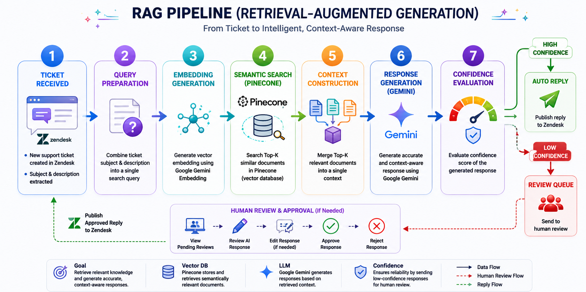

# 🧠 Retrieval-Augmented Generation (RAG) Pipeline

## Quick Summary

TicketMind uses a Retrieval Augmented Generation (RAG) architecture to generate accurate, context-aware responses for customer support tickets.

Instead of relying only on the language model's internal knowledge, the system retrieves relevant information from a private knowledge base stored in Pinecone before generating an answer.

This significantly improves accuracy, reduces hallucinations, and ensures responses are based on company-approved documentation.

---

# RAG Workflow

The following diagram illustrates the complete Retrieval-Augmented Generation (RAG) workflow implemented in TicketMind.



---

# Pipeline Steps

## 1. Ticket Received

Zendesk sends the ticket to the FastAPI webhook.

Example:

```text
Subject:
Password Reset

Description:
I cannot reset my password.
```

---

## 2. Query Preparation

The backend combines the ticket subject and description into a single query.

Example:

```text
Subject: Password Reset

Description:
I cannot reset my password
```

---

## 3. Embedding Generation

The query is converted into a vector embedding using Google's Gemini Embedding model.

This numerical representation enables semantic similarity search instead of keyword matching.

---

## 4. Semantic Search

The generated embedding is sent to Pinecone.

Pinecone retrieves the Top-K most relevant knowledge base documents.

Example:

```text
password_reset.txt
```

Similarity scores:

```text
0.7177
0.7126
0.7035
```

---

## 5. Context Construction

The retrieved documents are merged into a single context.

This context is injected into the prompt sent to Gemini.

---

## 6. Response Generation

Google Gemini receives:

- Customer question
- Retrieved context
- System instructions

The model generates a grounded response based only on the retrieved documentation.

---

## 7. Confidence Evaluation

The retriever score is used to determine the confidence level.

### High Confidence

The response is automatically published to Zendesk.

### Low Confidence

The response is stored in the Human Review Queue for manual approval.

---

# Advantages of Using RAG

- Reduces hallucinations
- Uses company-approved knowledge
- Easy knowledge base updates
- No model retraining required
- Fast semantic retrieval
- Scalable architecture

---

# Knowledge Base

Current documents include topics such as:

- Password Reset
- VPN Access
- Email Configuration
- Account Unlock
- Software Installation

New documents can be added without modifying the application code.

---

# Technologies Used

| Component | Technology |
|----------|------------|
| Embedding Model | Google Gemini Embedding |
| Vector Database | Pinecone |
| LLM | Google Gemini 2.5 Flash |
| Backend | FastAPI |
| Framework | LangChain |

---

# Example Execution

```
Customer Ticket
        │
        ▼
Generate Embedding
        │
        ▼
Pinecone Search
        │
        ▼
Top-K Documents
        │
        ▼
Context Construction
        │
        ▼
Gemini
        │
        ▼
Generated Answer
        │
        ▼
Confidence Check
        │
 ┌──────┴────────┐
 │               │
 ▼               ▼
Auto Reply   Human Review
```

---

# Next Documentation

Continue with:

- 03-Human-Review.md