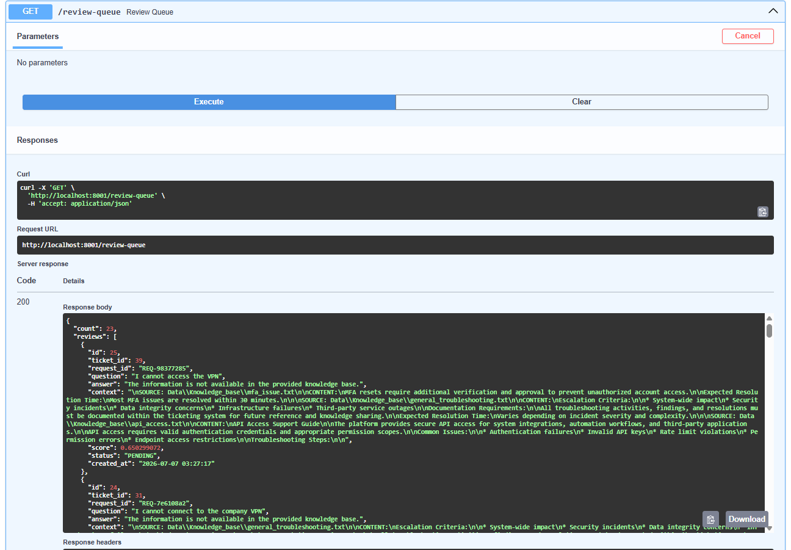

# 👨‍💻 Human Review Workflow

## Overview

One of the key features of TicketMind is its Human-in-the-Loop (HITL) workflow.

Instead of automatically responding to every customer ticket, the system evaluates the confidence of the generated response. If the confidence score is below the defined threshold, the response is routed to a Human Review Queue for manual validation before being published to Zendesk.

This approach improves response quality, minimizes incorrect AI-generated answers, and provides greater control over customer communication.

---

# Workflow

The following diagram illustrates the Human Review process.



---

# Human Review Process

### Step 1 — Ticket Received

A customer submits a support ticket through Zendesk.

---

### Step 2 — AI Response Generation

The RAG pipeline retrieves relevant knowledge and generates a response using Google Gemini.

---

### Step 3 — Confidence Evaluation

The AI evaluates the confidence of the generated answer.

If the confidence score is:

- Above the configured threshold → Auto Reply
- Below the configured threshold → Human Review

---

### Step 4 — Store Review

Low-confidence responses are stored in the local Review Queue database.

Each record includes:

- Ticket ID
- Customer Question
- AI Generated Answer
- Confidence Score
- Status
- Timestamp

---

### Step 5 — Review via Swagger

Support agents can review pending responses using the provided REST API.

Available actions include:

- View pending reviews
- Retrieve a specific review
- Edit the generated answer
- Approve the response
- Reject the response

---

### Step 6 — Approval

Once approved, the response is automatically published back to the corresponding Zendesk ticket.

---

# API Endpoints

| Endpoint | Description |
|----------|-------------|
| GET /review-queue | Retrieve pending reviews |
| GET /review-queue/{id} | Retrieve a specific review |
| PUT /review-queue/{id} | Update AI response |
| POST /review-queue/{id}/approve | Approve and publish |
| POST /review-queue/{id}/reject | Reject the review |

---

# Benefits

- Prevents incorrect AI responses
- Enables human oversight
- Improves customer trust
- Supports enterprise approval workflows
- Keeps a complete review history

---

# Example Workflow

```
Zendesk Ticket
        │
        ▼
AI Response
        │
        ▼
Confidence Evaluation
        │
   High        Low
     │           │
     ▼           ▼
Auto Reply   Review Queue
                 │
                 ▼
          Human Review
                 │
        ┌────────┴────────┐
        ▼                 ▼
    Approve           Reject
        │
        ▼
 Publish to Zendesk
```

---

# Next Documentation

Continue with:

- 04-Deployment.md