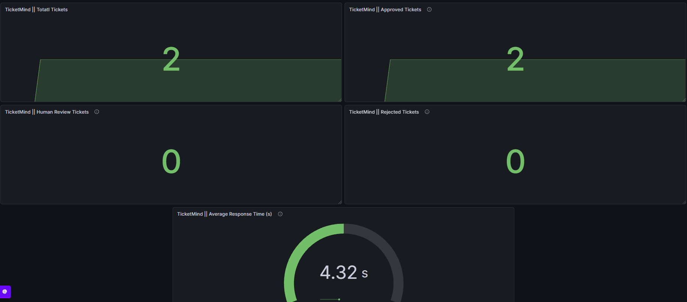

# 📊 Monitoring

## Overview

TicketMind includes built-in monitoring using Prometheus and Grafana to provide real-time visibility into application health, AI workflow performance, and operational metrics.

The monitoring stack enables developers and support teams to quickly identify issues, monitor ticket processing, and observe overall system behavior.

---

# Monitoring Stack

| Component | Purpose |
|----------|----------|
| Prometheus | Collects application metrics |
| Grafana | Visualizes collected metrics |
| FastAPI | Exposes `/metrics` endpoint |

---

# Prometheus

Prometheus periodically scrapes the FastAPI `/metrics` endpoint and stores time-series metrics.

Scrape Interval:

```yaml
15 seconds
```

Metrics Endpoint:

```
GET /metrics
```

---

# Grafana Dashboard

Grafana connects directly to Prometheus and visualizes system metrics through interactive dashboards.

Current Dashboard Panels:

- Total Tickets
- Auto Approved Tickets
- Human Review Queue
- Rejected Tickets
- Average Response Time

---

# Custom Metrics

TicketMind exposes several custom Prometheus metrics.

| Metric | Description |
|----------|-------------|
| resolve_tickets_total | Total processed tickets |
| resolve_auto_approved_total | Automatically approved responses |
| resolve_human_review_total | Tickets requiring manual review |
| resolve_rejected_total | Rejected responses |
| resolve_response_time_seconds | Average AI response time |

---

# Monitoring Workflow

```
FastAPI

    │

    ▼

/metrics Endpoint

    │

    ▼

Prometheus

    │

    ▼

Grafana Dashboard
```

---

# Health Monitoring

The application exposes a dedicated health endpoint.

```
GET /health
```

Example response:

```json
{
    "status": "healthy"
}
```

---

# Dashboard Preview

The following dashboard provides a real-time overview of TicketMind system metrics.



---

# Prometheus Targets

Prometheus verifies that the FastAPI service is reachable.

Expected status:

```
UP
```

---

# Benefits

- Real-time monitoring
- AI workflow visibility
- Response time tracking
- Ticket processing statistics
- Health monitoring
- Production-ready observability

---

# Next Documentation

Continue with:

- 06-API-Reference.md